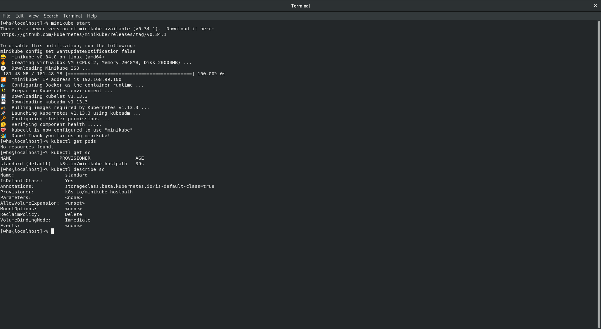

[](https://circleci.com/gh/whs-dot-hk/kubernetes-nifi-refined)

For clusters, check out our [cluster guide](https://github.com/whs-dot-hk/kubernetes-nifi-refined/tree/master/cluster-guide)

## Standard Usage
[](https://asciinema.org/a/OYN3fdGCBOtoDqCZ4UKc5DjWK)

```
$ kubectl create -f https://raw.githubusercontent.com/whs-dot-hk/kubernetes-nifi-refined/master/nifi.yaml
$ kubectl create -f https://raw.githubusercontent.com/whs-dot-hk/kubernetes-nifi-refined/master/nifi-service.yaml
```

```
$ kubectl create -f https://raw.githubusercontent.com/whs-dot-hk/kubernetes-nifi-refined/master/frontend.yaml
```

```
$ export POD_NAME=$(kubectl get pods --namespace default -l "app=nifi-frontend" -o jsonpath="{.items[0].metadata.name}")
$ kubectl port-forward $POD_NAME 8080:8080
```

Visit http://localhost:8080/nifi

## Minikube StatefulSet Example


```
$ kubectl create -f https://raw.githubusercontent.com/whs-dot-hk/kubernetes-nifi-refined/master/nifi-statefulset-minikube.yaml
$ kubectl create -f https://raw.githubusercontent.com/whs-dot-hk/kubernetes-nifi-refined/master/nifi-service.yaml
$ kubectl create -f https://raw.githubusercontent.com/whs-dot-hk/kubernetes-nifi-refined/master/frontend.yaml
```

## Other Example
https://bitbucket.org/whshk/kubernetes-logging/src/master
