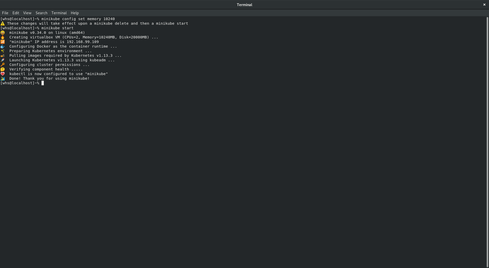
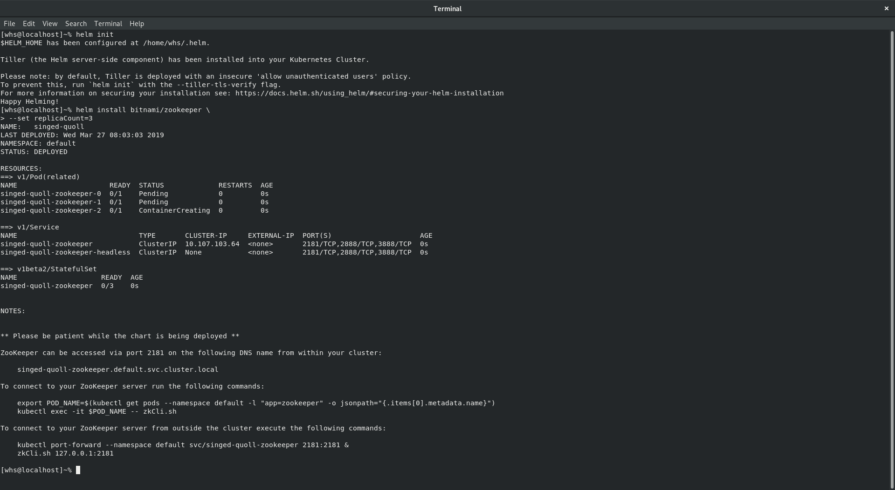
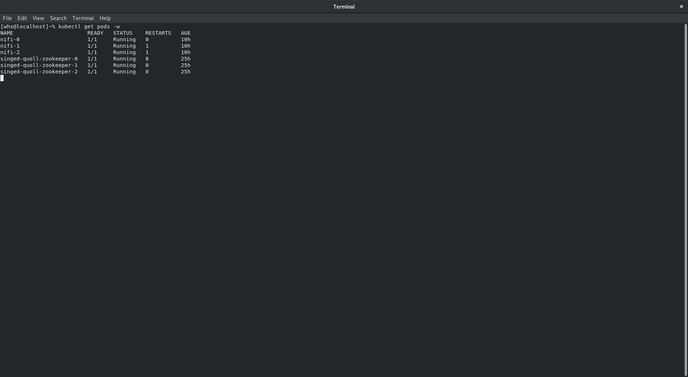
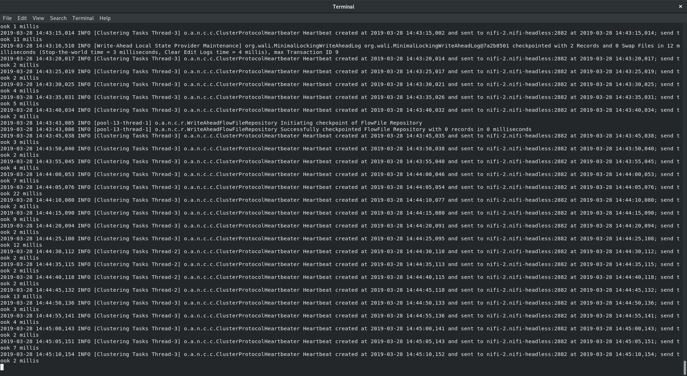
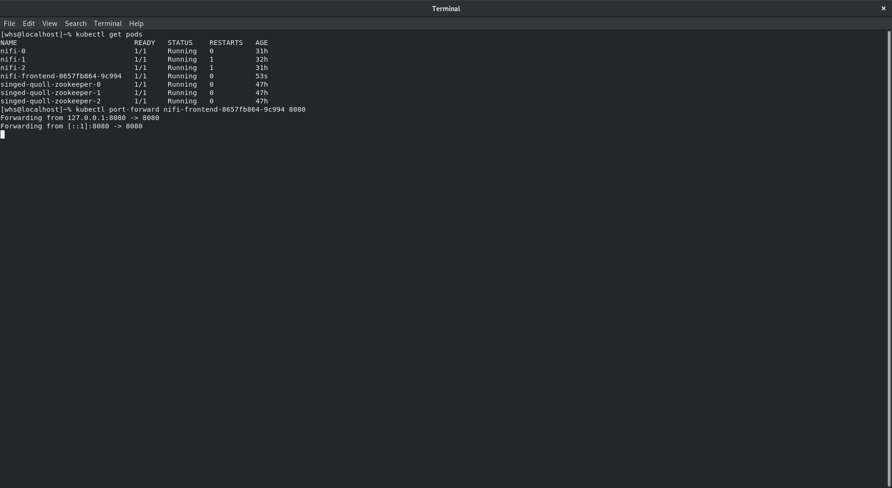
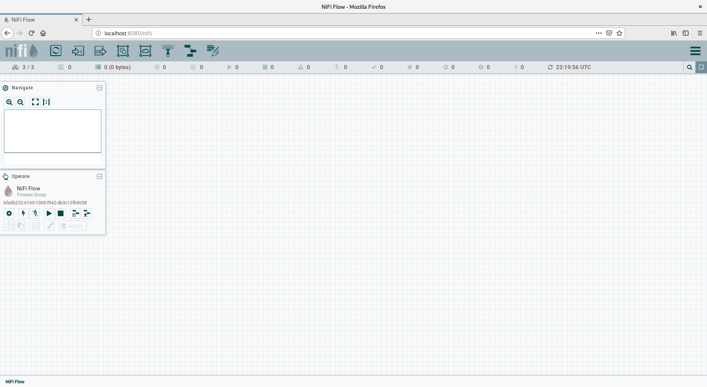

## Start Minikube

```
$ minikube config set memory 10240
$ minikube start
```

## Install Zookeeper

```
$ helm init
$ helm install bitnami/zookeeper \
--set replicaCount=3
```
You may need to run `helm repo add bitnami https://charts.bitnami.com`
to add bitnami's repo.

## Deploy Nifi
You will need to modify
[line 43](https://github.com/whs-dot-hk/kubernetes-nifi-refined/blob/a6497b626e965b97c1ba8a73bbaf83ae55491cd2/nifi-statefulset-minikube-cluster.yaml#L43)
to be your zookeeper service name.
Here `singed-quoll-zookeeper` is our zookeeper service name (See
screenshot above).
```
$ wget https://raw.githubusercontent.com/whs-dot-hk/kubernetes-nifi-refined/master/nifi-statefulset-minikube-cluster.yaml
```
Edit line 43.
```
$ kubectl create -f nifi-statefulset-minikube-cluster.yaml
```


## Deploy Frontend

Here, we run `kubectl logs nifi-0` and found the primary node `nifi-2`.
So we deploy the nifi service with external name `nifi-2.nifi-headless.default.svc.cluster.local`.

```
$ kubectl create -f https://raw.githubusercontent.com/whs-dot-hk/kubernetes-nifi-refined/master/cluster-guide/nifi-service-externalname-2.yaml
$ kubectl create -f https://raw.githubusercontent.com/whs-dot-hk/kubernetes-nifi-refined/master/frontend.yaml
```

## Port Forward Frontend


## Enjoy

